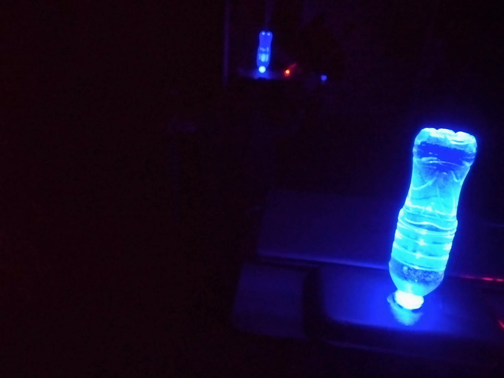
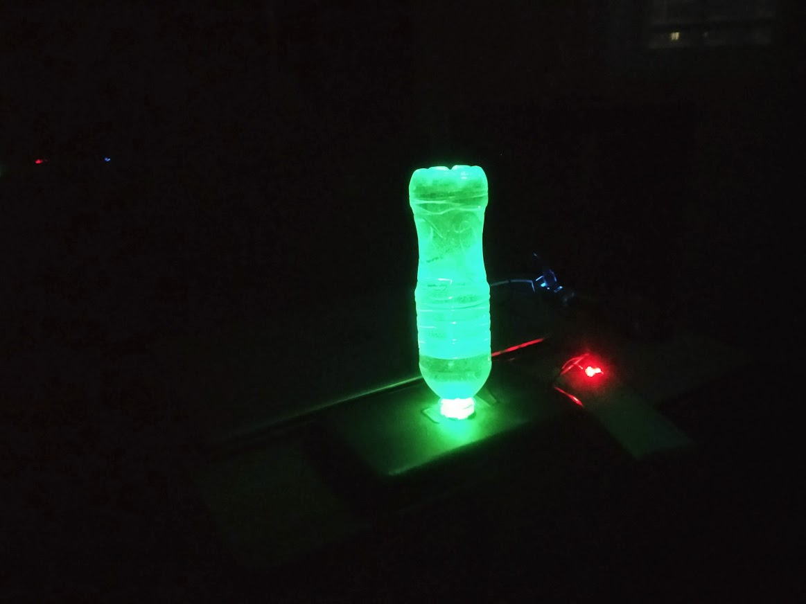

# Water-Bottle-LED-Arduino
Code and examples for LED water bottle with glue, chess package and Arduino Nano with plateboard

Scheme:
<ul>
<li>D11 - R
<li>D10 - G
<li>D9 - B
<li>GND Nano - negative LED
 </ul>

